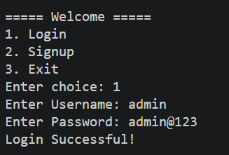
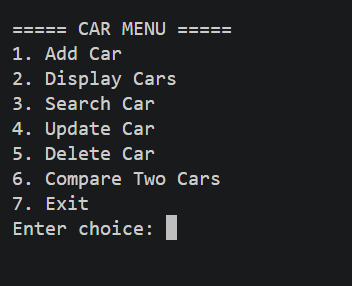
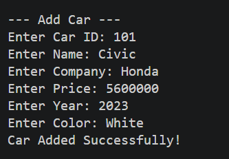
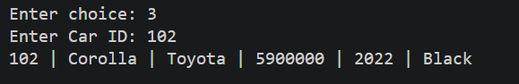
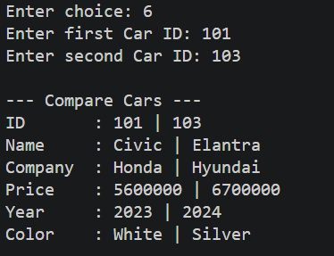

# Car Management System (C++)

A console-based Car Management System developed in **C++** as a semester project for the **Programming Fundamentals** course.

## Overview

This application allows users to manage car records through a simple menu-driven interface. It also includes a basic login and signup system using file handling to store user credentials and car data.

## Features

- User Login & Signup
- Add New Cars
- Display All Cars
- Search Car by ID
- Update Car Details
- Delete Car Records
- Compare Two Cars
- File Handling for Data Storage

## Technologies Used

- C++
- File Handling
- Structures
- Functions
- Arrays

## Project Structure

```
main.cpp
cars.txt
users.txt
```

## How to Run

1. Clone this repository.
2. Open the project in your preferred C++ IDE.
3. Compile and run `main.cpp`.
4. Ensure `cars.txt` and `users.txt` are in the same directory.

## What I Learned

This project helped me strengthen my understanding of:

- Programming Fundamentals
- C++ Programming
- File Handling
- Functions
- Structures
- Menu-driven Applications
- Team Collaboration

## Team Project

This project was developed as part of a group assignment for the Programming Fundamentals course.

## License

This project is intended for educational purposes.

## Application Preview

### Login


### Main Menu


### Add Car


### Display Cars


### Search Car


### Compare Cars

